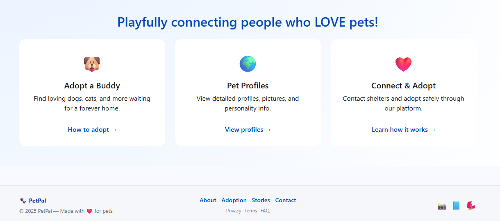
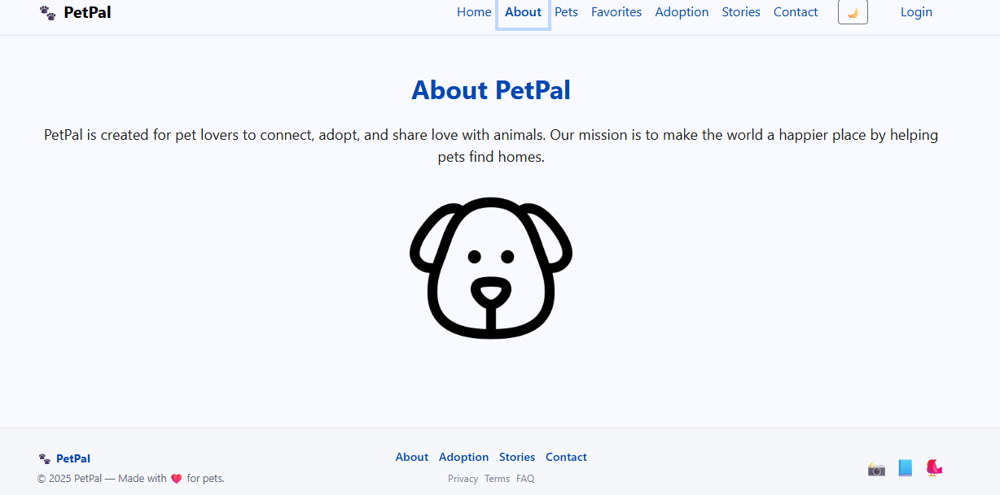
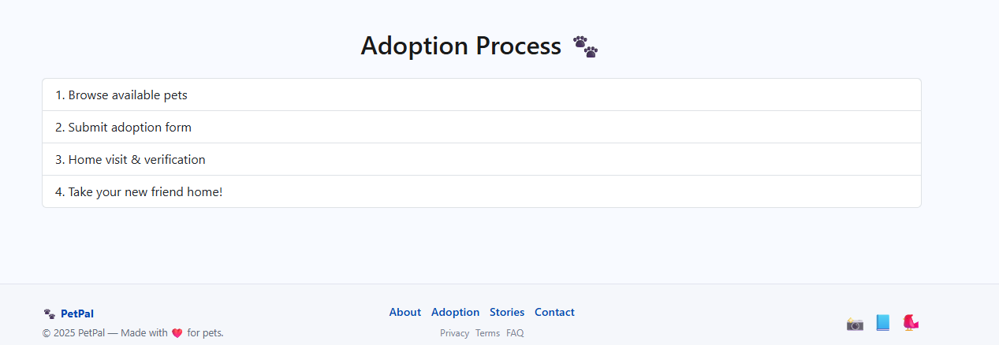
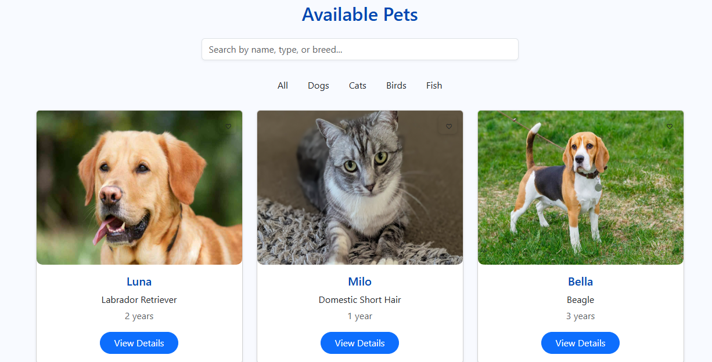
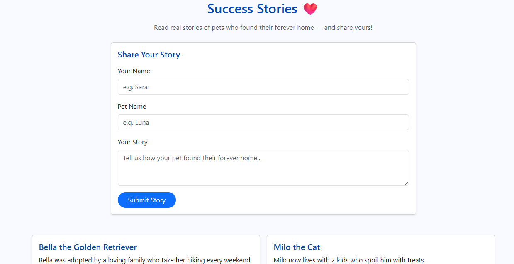
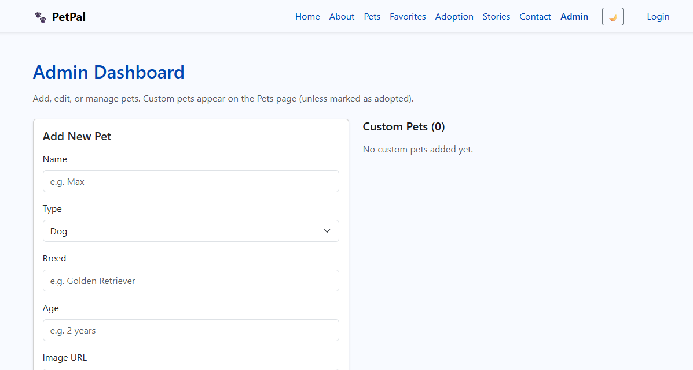

# 🐾 PetPal – Pet Adoption Platform

PetPal is a responsive ReactJS web application designed to help users find pets available for adoption, view detailed profiles, mark favorites, read success stories, and contact shelters.  
The project also includes an Admin Dashboard for managing pet data and a Dark/Light mode theme switch.

This project fulfills all requirements for the Web Development course final project.

---

## 📌 Table of Contents
1. [Project Description](#project-description)  
2. [Features](#features)  
3. [Technologies Used](#technologies-used)  
4. [Project Pages](#project-pages)  
5. [Setup Instructions](#setup-instructions)  
6. [Folder Structure](#folder-structure)  
7. [Screenshots](#screenshots)  
8. [Deployment Link](#deployment-link)  
9. [Contributors](#contributors)

---

## 🐶 *Project Description*
PetPal is a modern and user-friendly pet adoption platform built with *ReactJS* and *Bootstrap*. Users can browse available pets, search and filter by type, add favorites, contact shelters, and submit adoption requests.

The project also includes:
- Admin Login  
- Admin Dashboard (Add / Edit / Delete pets)  
- Light/Dark mode toggle  
- Responsive UI for all devices  
- LocalStorage support (favorites, theme, admin login)

---

## ✨ *Features*
### 👩‍💻 User Features
✔ Browse all pets  
✔ View detailed pet profiles  
✔ Mark/unmark favorites  
✔ Adoption request form  
✔ View success stories  
✔ Contact & shelters info  
✔ Fully responsive design  

### 🛠 Admin Features
✔ Admin login  
✔ Add new pets  
✔ Edit existing pets  
✔ Delete pets  
✔ Manage custom pets saved in LocalStorage  

### 🌙 Theme
✔ Light & Dark mode toggle (saved in localStorage)

---

## 🧰 *Technologies Used*
- *ReactJS*
- *React Router DOM*
- *Bootstrap 5*
- *AOS Animation Library*
- *CSS3*
- *LocalStorage API*
- *Git & GitHub*

---

## 📄 *Project Pages*
| Page | Description |
|------|-------------|
| Home | Overview, CTA buttons, hero section |
| About | Information about the platform |
| Pets | Search, filter, view all pets |
| Pet Details | Detailed page + Adopt form |
| Favorites | Saved users favorites |
| Adoption | Adoption process guide |
| Stories | Success stories |
| Contact | Contact + form |
| Admin Login | Restricted login |
| Admin Dashboard | Add / Edit / Delete pets |

---

## ⚙️ *Setup Instructions*
Follow these steps to run the project locally:

### 1️⃣ Clone the repository
```sh
git clone https://github.com/22089359-leen/petpal.git
##Home Page 


##About page

##Process page

##Pets page

##Favorites page

##Stories page

##Contact page

##Login Page

##Admin page
